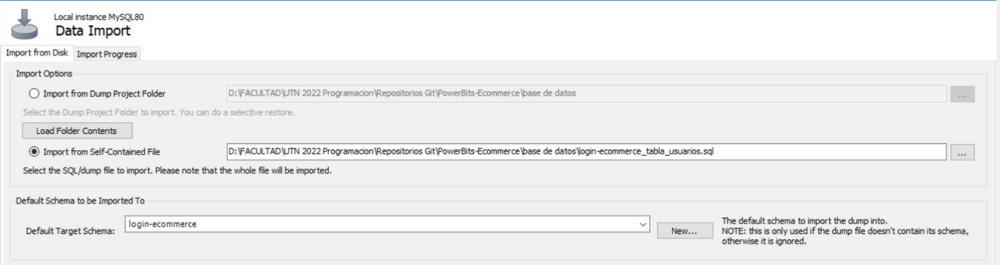

<div align="center">
  <h1>𝐏𝐎𝐖𝐄𝐑 𝐁𝐈𝐓𝐒</h1>
  <h2>𝐄𝐂𝐎𝐌𝐌𝐄𝐑𝐂𝐄 - 𝐏𝐎𝐖𝐄𝐑 𝐒𝐓𝐎𝐑𝐄</h2>

  
</div>


_En Power Store, somos mucho más que una simple tienda de insumos tecnológicos; somos tu puerta de entrada al emocionante y vibrante universo gamer._

Estamos comprometidos en brindarte una experiencia única y completa en la adquisición de productos de la más alta calidad, diseñados específicamente para satisfacer las necesidades de los gamers apasionados.

No solo vendemos productos, sino que también compartimos la misma pasión que nuestros clientes por el gaming. Comprendemos la importancia de tener el equipo adecuado para disfrutar al máximo de cada partida, por lo que nos esforzamos por mantenerte al día con las últimas tendencias y lanzamientos en la industria. 

Hemos diseñado un sitio web ágil, fácil de comprender y sencillo, para que tu experiencia de compra sea sin complicaciones. Creemos que encontrar el equipo perfecto para tus necesidades no debería ser una tarea difícil, y es por eso que hemos trabajado arduamente para que nuestra plataforma sea intuitiva y amigable.


---

<div> <h3 align="center" </h3>
 Tecnologías </div>

<div align="center" width="70" >

| Front End y Back End |
| --------------------|
|  HTML |
|  CSS |
|  JavaScript |
|  Node.js |
|  Nodemon |
|  Express.js |
|  Ejs |
|  Express-session |
|  SDK |

</div>

---
<div align="center">
  <h3 align="center">Controlador de versiones</h3>
  <a href="https://www.mysql.com/" target="_blank" rel="noreferrer"> 
     
     
  </a>
</div>

---

<div align="center">
  <h3 align="center">Manejador de paquetes</h3>
  <a href="https://www.mysql.com/" target="_blank" rel="noreferrer"> 
     
  </a>
</div>

---

<div align="center">
  <h3 align="center">Base de datos</h3>
  <a href="https://www.mysql.com/" target="_blank" rel="noreferrer"> 
     
  </a>
</div>

---
<div> <h3 align="center" </h3>
 Visualizacion del proyecto de forma local </div>
  
- Paso 1 - Clonar el repositorio en nuestra pc:
```bash
  git clone https://github.com/CodeSystem2022/PowerBits-Ecommerce.git
```
- Paso 2 - Instalar dependencias:
```bash
  npm install
```
- Paso 3 - Importar la base de datos:
  - Abrir un cliente MySQL o una interfaz de administración, como MySQL Workbench
  - Ir a server/data import
  - Seleccionar la ruta del archivo .sql en el repositorio para que automaticamente se cree la tabla con todas las columnas configuradas
    


- Paso 4 - Abrir la terminal de VSC y ejecutar el siguiente comando:
  - con este comando se inicia el servidor en http://localhost:3000
```bash
  nodemon dev
```
- Paso 5 - Abrir http://localhost:3000 en el navegador para poder visualizar el ecommerce

<div>
  <h3 aling="center">Con estos simples pasos se puede visualizar el ecommerce con todas sus funcionalidades y metodo de pago</h3>
</div> 

---


<div>
  <h3 align="center"> 𝙸𝚗𝚝𝚎𝚐𝚛𝚊𝚗𝚝𝚎𝚜 de Power Bits </h3>
  
  👾 [𝙰𝚗𝚝𝚘𝚗𝚎𝚕𝚕𝚊 𝙰𝚛𝚛𝚊𝚎𝚣](https://github.com/antonellaarraez)
  
  👾 [𝙵𝚊𝚌𝚞𝚗𝚍𝚘 𝚁𝚒𝚘𝚜](https://github.com/jfacundorios)
  
  👾 [𝙷é𝚌𝚝𝚘𝚛 𝙵𝚘𝚗𝚣𝚊𝚕𝚒𝚍𝚊](https://github.com/hector-fonzalida)
  
  👾 [𝙸𝚟𝚊𝚗𝚊 𝙶𝚘𝚗𝚣á𝚕𝚎𝚣](https://github.com/IviiGonzalez)
  
  👾 [𝙹𝚞𝚊𝚗 𝙼𝚊𝚌𝚑𝚞𝚌𝚊](https://github.com/juaniM4c)
  
  👾 [𝙻𝚞𝚌𝚊𝚜 𝙼𝚎𝚗𝚍𝚎𝚣](https://github.com/LucasMendez11)
  
  👾 [𝙽𝚊𝚍𝚒𝚊 𝙶𝚘𝚗𝚣á𝚕𝚎𝚣](https://github.com/NadiaGonzalez27)
  
  👾 [𝙽𝚒𝚌𝚘𝚕á𝚜 𝙼𝚊𝚌𝚑𝚞𝚌𝚊](https://github.com/Nico25Mac)
   
</div>

